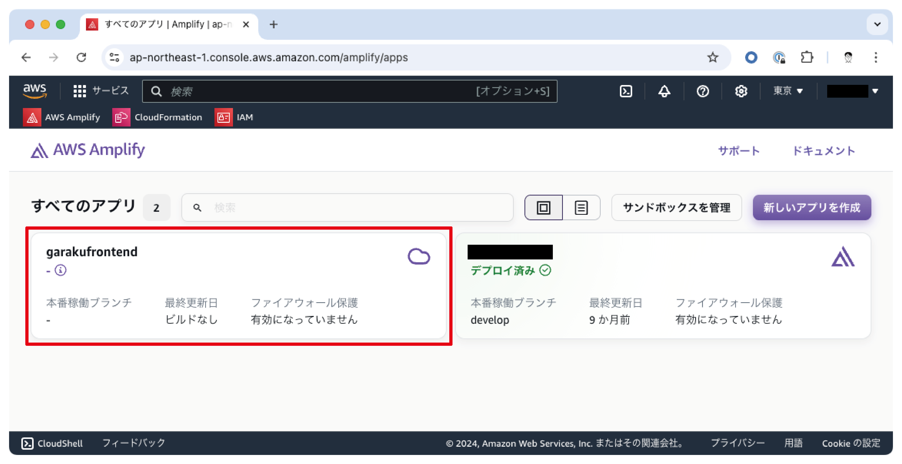
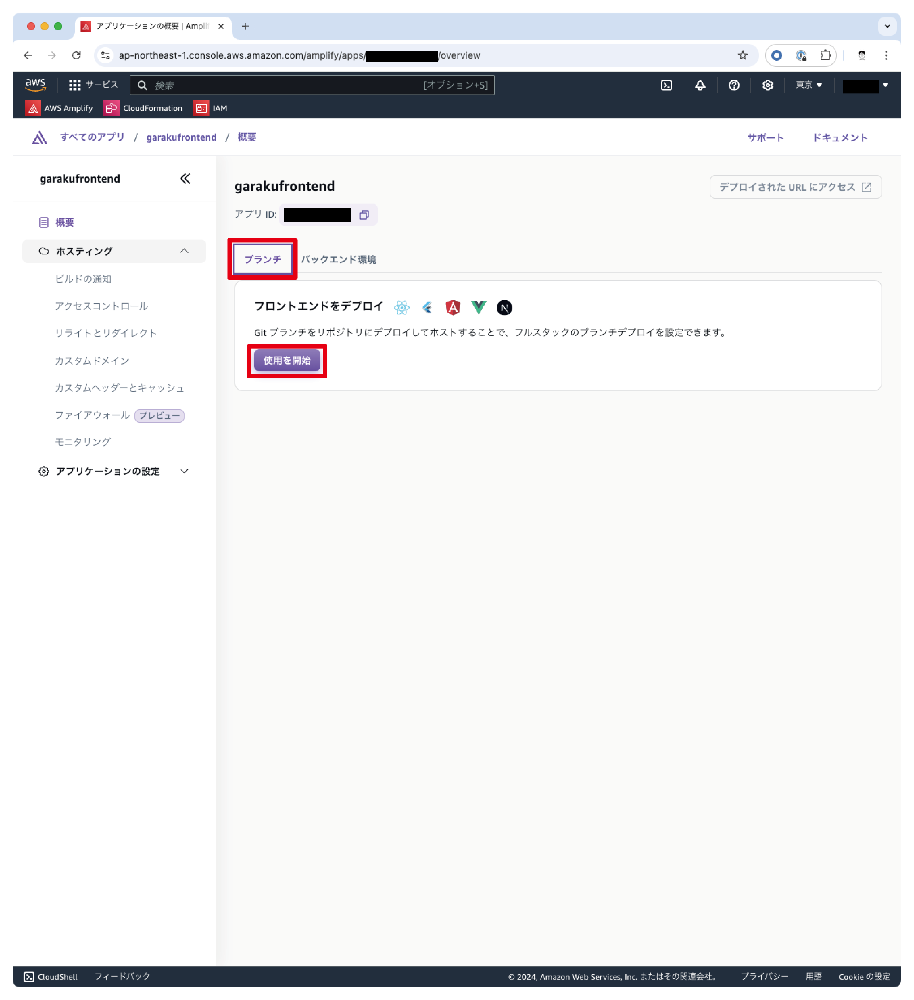
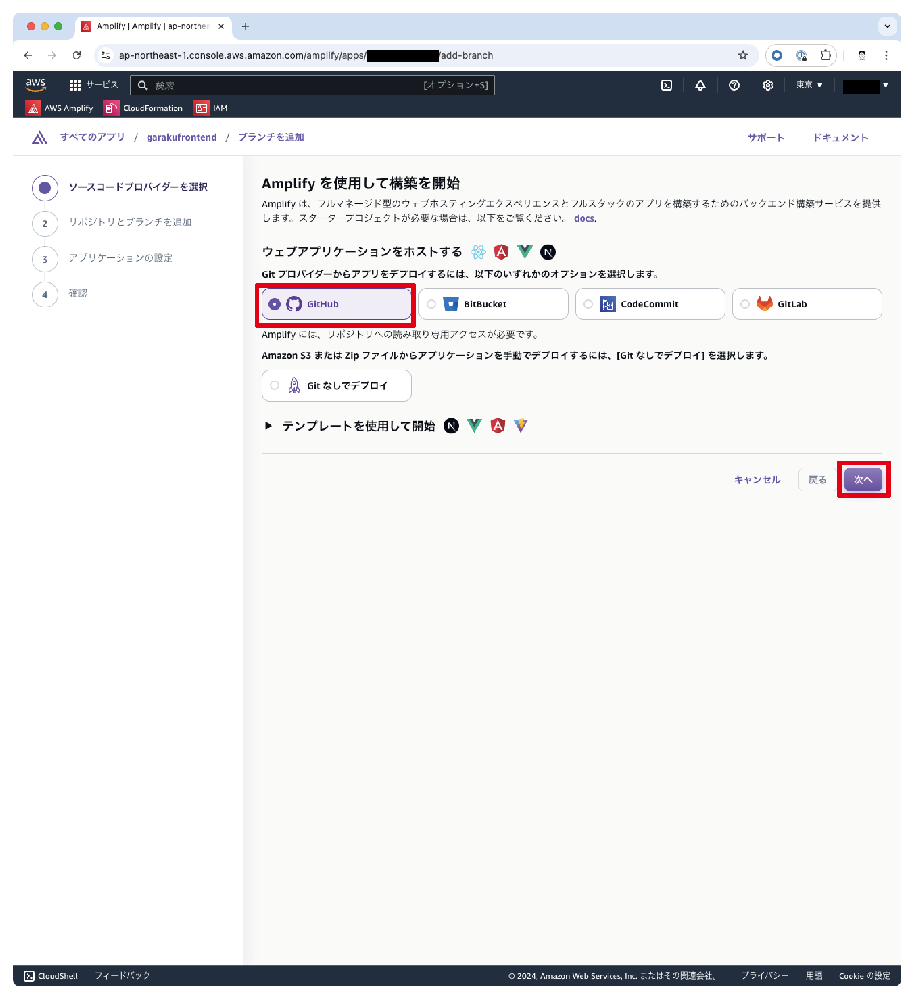
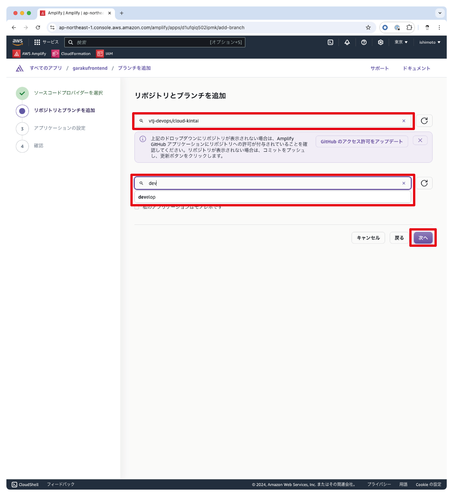
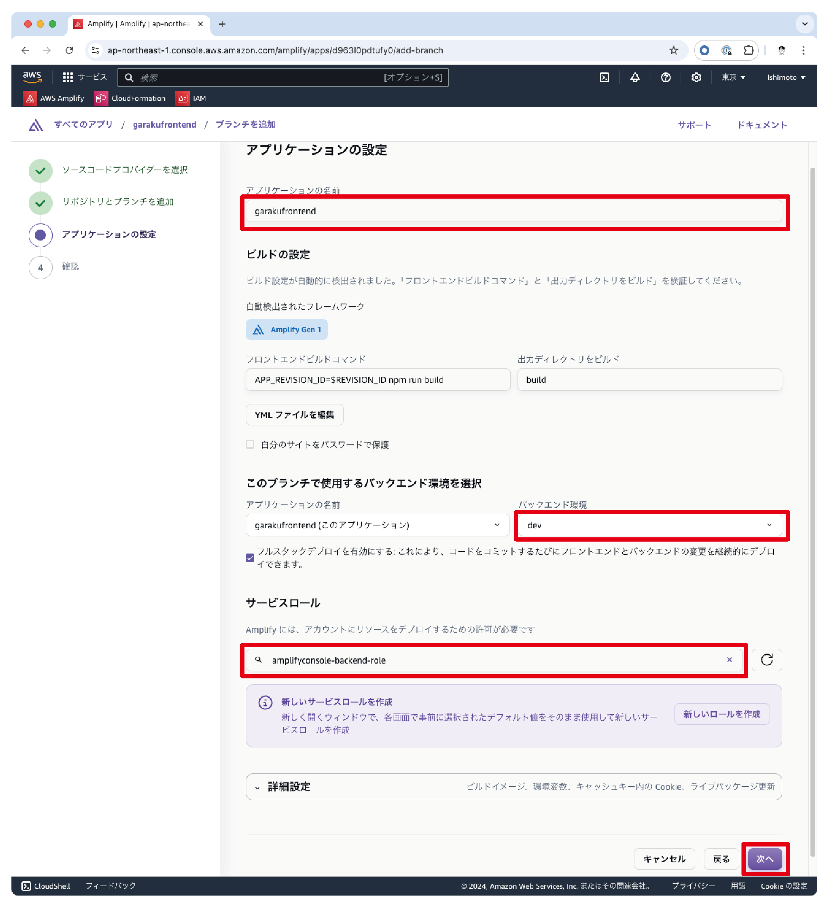
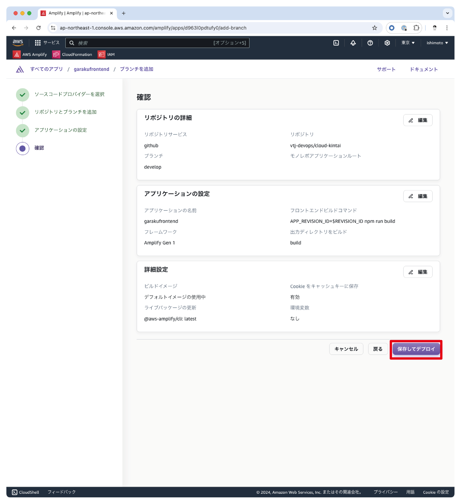
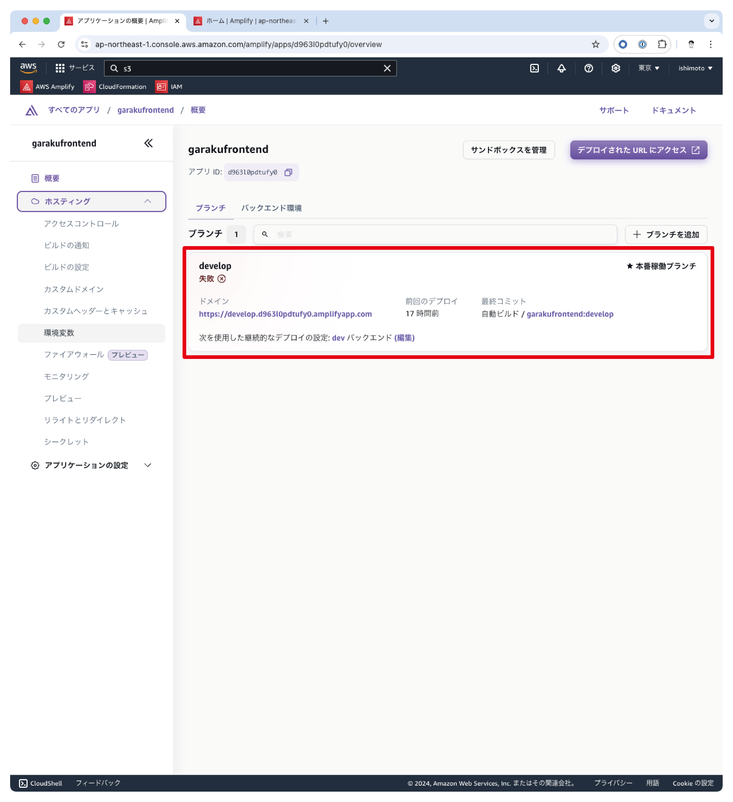

# クラウド勤怠

社内向けシステムとして開発された勤怠管理システムです。

## 目次

- [aaa](#aaa)

## 必要なツール

- [AWS CLI](https://docs.aws.amazon.com/ja_jp/cli/latest/userguide/getting-started-install.html): AWS CLIを使用してAWSリソースを操作します。
- [Amplify CLI](https://docs.amplify.aws/gen1/javascript/tools/cli/start/set-up-cli/): Amplify CLIを使用してAWS Amplifyの操作を行います。

## セットアップ

AWS CLIを使用してAWSリソースを操作するため、AWS CLIの設定を行います。

```bash
aws configure --profile cloud-kintai
```

設定内容は以下の通りです。

```bash
amplify init
```

いくつかの質問に答えていきます。

> ? Enter a name for the environment dev

作成する環境の名前を入力します。`dev` と入力してください。

> ? Choose your default editor: Visual Studio Code

デフォルトのエディターを選択します。`Visual Studio Code` を選択してください。

> ? Select the authentication method you want to use: AWS profile

認証方法を選択します。`AWS profile` を選択してください。

## バックエンド環境の構築

```bash
amplify push
```

> ? Are you sure you want to continue? (Y/n)

処理を続行するか確認されます。`Y` と入力してください。

必要な環境変数を入力します。

> ? Enter the missing environment variable value of REGION in garakuSendMail:

リージョンを入力します。`ap-northeast-1` と入力してください。

> ? Enter the missing environment variable value of EMAIL_FROM in garakuSendMail:

メールの送信元を入力します。

> ? Are you sure you want to continue? (Y/n) · yes

処理を続行するか確認されます。`yes` と入力してください。

> ? Do you want to update code for your updated GraphQL API (Y/n)

GraphQL APIの更新を行うか確認されます。`Y` と入力してください。

> ? Do you want to generate GraphQL statements (queries, mutations and subscription) based on your schema types?
This will overwrite your current graphql queries, mutations and subscriptions (Y/n)

GraphQLステートメントを生成するか確認されます。`Y` と入力してください。

## フロントエンド環境の構築

GitHubと接続してCI/CD連携を前提としています。GitHubと接続するためには[AWS Console](https://aws.amazon.com/jp/console/)にログインしてから画面上での操作が必要です。

[Amplifyのコンソール画面](https://ap-northeast-1.console.aws.amazon.com/amplify/apps)に移動します。`garakufrontend` が作成されていますので、クリックしてください。



GitHubと接続してCI/CD連携を行います。`ブランチ`タブが選択されていることを確認してから、`使用を開始`をクリックしてください。



GitHubをはじめさまざまなサービスを選択できますが、今回はGitHubを選択します。`GitHub`をクリックしてください。



リポジトリとブランチを選択します。`cloud-kintai` リポジトリを選択してからdevelopブランチを選択してください。本番環境やその他の環境を構築する場合は、それぞれのブランチを選択してください。



次にアプリケーション名と接続するバックエンド環境、サービスロースを選択します。



`アプリケーション名`は、好きな名前を入力してください。

`このブランチで使用するバックエンド環境を選択`は、`dev` を選択してください。本番環境やその他の環境を構築する場合は、それぞれの環境を選択してください。

`サービスロール`は、Amplifyで使用するサービスロールを選択します。選択できるサービスロールがない場合は、新しく作成してください。標準的な手順で進めるとサービス名で作成すると`amplifyconsole-backend-role` となります。

すべての設定が完了したら、`次へ`をクリックしてください。



ここまででGitHubとの連携が干渉して、CI/CDが設定されました。初回のデプロイは接続ができた段階で自動的に行われます。

デプロイ中にエラーが発生しますが、S3のバケット名を必要な設定が不足しているためです。S3は、アプリケーション側で新しいデプロイが行われたかどうかをチェックする機能で使用しています。



